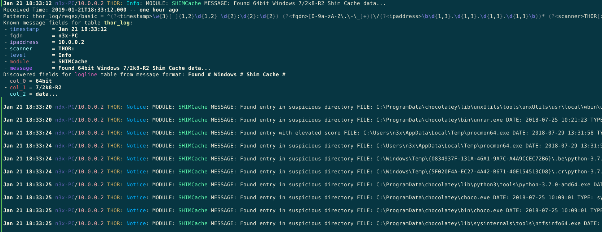

# lnav-thor

Syntax Highlighting for THOR & SPARK APT-Scanner logfiles.

[lnav](http://lnav.org) is a powerful log file viewer, designed to take multiple log files and order them by date.




## lnav

"The log file navigator, lnav, is an enhanced log file viewer that takes advantage of any semantic information that can be gleaned from the files being viewed, such as timestamps and log levels. Using this extra semantic information, lnav can do things like interleaving messages from different files, generate histograms of messages over time, and providing hotkeys for navigating through the file. It is hoped that these features will allow the user to quickly and efficiently zero in on problems."

- [GitHub repository](https://github.com/tstack/lnav)
- [Official homepage](http://lnav.org/)
- [Official documentation](https://lnav.readthedocs.io/en/latest/)

## Other formats

Big Thanks to Paul Wayper! He presented lnav at the Linux.conf.au in 2016 and wrote a lot of custom formats for the tool.

The recording of his talk can be found here, which also includes a short intro into lnav: [Paul Wayper - Using lnav - linux.conf.au 2016](https://www.youtube.com/watch?v=D9Tox1ysPXE)

His GitHub repo includes a lof of useful other log formats: [PaulWay/lnav-formats](https://github.com/PaulWay/lnav-formats)

## THOR & SPARK

If you are not familar with THOR or SPARK please check the official webpage:

- [Offical webpage: THOR](https://www.nextron-systems.com/thor/)
- [Offical webpage: SPARK](https://www.nextron-systems.com/spark/)

There is also a free variant of SPARK named SPARK Core available: [SPARK Core](https://www.nextron-systems.com/spark-core/)


## Installation

Just checkout this repo and install the json-files with:

```
lnav -i spark_log.json
lnav -i thor_log.json
```

lnav registers the new logformat and creates a copy of the files in the `$HOME/.lnav/formats/installed` folder.

Afterwars open the THOR/SPARK report file with lnav and the syntax will be highlighted. Also various fields will be extracted and can be used in queries in lnav.
To show this fields just scroll onto the line and press 'p' for "Pretty printing".

**Note**: If you recognize empty lines between the single thor entries, you have to convert the windows line breaks <CR><LF> to your corresponding os format. On Linux and Mac us can use dos2unix for the conversion.
